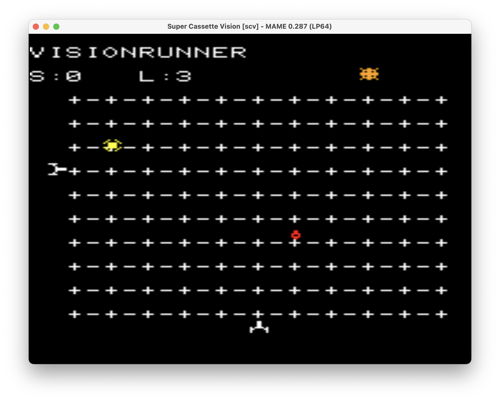

# SCeVe

A semi-c SDK for the Epoch Super Cassette Vision

You know when you have an idea for something and it seems like a good idea at the time but as you work on it you realise that it's actually quite a stupid idea, but by that point you're starting to see results so you push on anyway?

That's this project.

The Super Cassette Vision is one of my favourite consoles of it's generation, it was a curious mix of 3rd generation ability with 2nd generation thinking. So when I started making versions of Jurl I looked at the SCV as a potential candidate. Whilst doing this I discovered the l65 project by G012 (https://github.com/g012/l65) and, more specifically, the l7801 additions by BlockoS.

This rather amazing Lua based assembler allowed creation of SCV games and had some samples available too.

Now, whilst I have done assembler (i'm old enough that it was a prerequisite), I have to admit that I struggle with it a lot more than I do C.  I can do it, it just takes time.

So, I thought, with the assembler/linker taken care of - what about if I just make a parser to take a subset of C and emit the compatible code needed for the l7801 to work with?

I've given up on this project numerous times, got bored, got stuck, added a bit, changed some bits.  But until recently I didn't think i'd ever release this.

Then two weeks ago a project successfully compiled.  It didn't show anything, but it also didn't show balloons (the standard SCV, I don't have anything to run response).  That meant that "something" was running.

I then dug into some of the sample code that BlockoS made and realised I wasn't setting some startup flags correctly. And suddenly, text appeared.

So i've very quickly implemented some functions, text, graphics and sound.  None of them are great and will require more work.  The background tile stuff is still a bit dodgy, scrolling backgrounds don't really work at all.  But you can show text and a sprite and move the sprite around, you can even make it beep.  That's the basics of an SDK.

## Dependencies
You need pycparser installed for the actual c_to_l7801.py converter
For the graphics converters you'll need Pillow installed

The parser has now moved beyond l7801.  To implement a couple of functions I had to use some opcodes that aren't available in it, or at least don't seem to encode correctly. But I have now made two projects using the included assembler and its been fine.

## How to use it
There are numerous examples, but they've kind of evolved with the project, so some of them do things a bit differently.  game_demo.c *should* be pretty up to date with stuff.

This is a very small subset of C, it has some niceties like structs and enums, but it's missing a few important bits that can make writing a game a little trickier, like for and switch.  Also, no actual headers are supported, there's no stdio, no stdlib.  I've implemented text writing, strlen and a limited sprintf command though.

Basically I concentrated on stuff that I knew I used for Jurl.

More information in the tools folder.

But basically, create a c file, run it through c_to_l7801.py and (if that works) run the resultant .l7801 file through asm7801.  That should get you a bin file that can be run on an SCV or an emulator.

I should also add that i've NEVER tested this on an actual SCV. I should build a cartridge at some point.

Anyway, have fun.

~~N.B. No, I never made Jurl using this.  In the time between starting it and now I managed to release 30 versions of Jurl on other platforms and i'm a little burnt out now.  Maybe in the future.~~

Ok, I have now written most of Jurl for the Super Cassette Vision, it's available at https://tonsomo.itch.io

## Example Images

